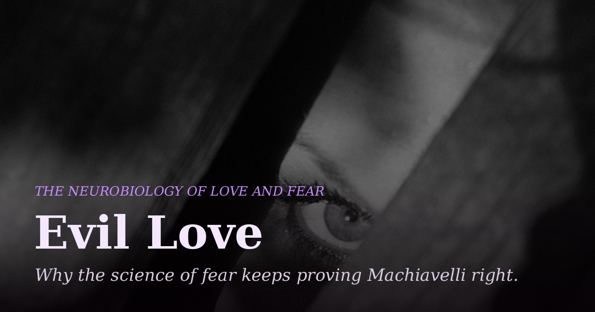

# Evil Love — The Neurobiology of Love and Fear

A research article based on thoughts by Setvin Noether ([@SauerNinja](https://github.com/SauerNinja)). Estimated reading time: 28 minutes.

This piece places Niccolò Machiavelli's five-hundred-year-old argument in *The Prince* — that it is safer to be feared than loved — directly alongside the modern neuroscience of attraction, attachment, betrayal, and fear. It argues that the two disciplines converge on the same uncomfortable conclusion: romantic love runs on the brain's dopamine reward circuitry, the same pathway implicated in substance addiction, which makes it volatile, tolerance-prone, and dependent on another person's ongoing goodwill. Fear, by contrast, is maintained by largely self-sustaining neural mechanisms — learning-independent circuits, metaplasticity, observational conditioning — that require no reciprocity at all.

Across nineteen sections, the essay traces this argument through the tripartite lust/attraction/attachment model of romantic love, the shared neural circuitry of love and hate, the hormonal mechanics of fear-based compliance, the Dark Triad's exploitation of the fawn response, a close reading of Machiavelli's historical case studies (Oliverotto da Fermo, Agathocles, Severus, Castruccio Castracani), the biology of betrayal trauma and moral disgust, and — in its final sections — the specific physiological mechanisms that offer an actual exit from both fear-based control and addictive attachment.

It closes by turning the same lens on Machiavelli himself: an account of his final months during the sack of Rome, his rejection by the Florentine republic he loved, and his death in 1527, read as the one place in his own life where the theorist of cold calculation failed to apply his own doctrine.

## Files

- `index.html` — the complete article
- `README.md` — this file
- `LICENSE` — MIT License
- `404.html` — themed not-found page
- `sitemap.xml` / `robots.txt` — search engine infrastructure
- `hero.jpg` — hero image
- `og-image.jpg` — social share preview image
- `favicon.ico`, `favicon-16x16.png`, `favicon-32x32.png`, `apple-touch-icon.png`, `icon-192.png`, `icon-512.png` — favicons

## License

MIT — see `LICENSE`.
